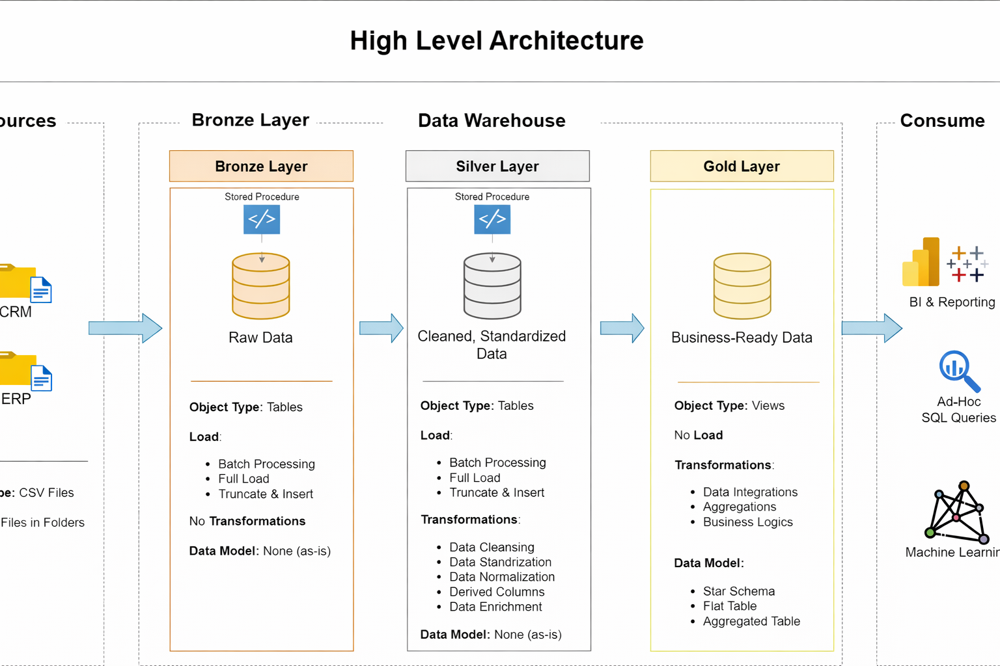
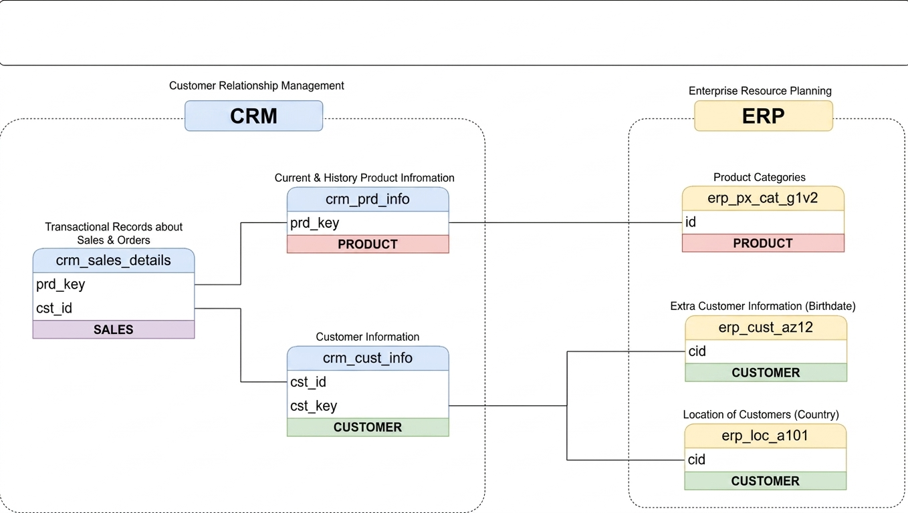

# sql-data-warehouse-project

# Data Warehouse and Analytics Project

Welcome to the Data Warehouse and Analytics Project repository! 🚀

This project demonstrates the implementation of a SQL-based modern data warehouse using Medallion Architecture principles. The repository showcases data engineering concepts including ETL processing, layered architecture, data modeling, and analytical reporting.

---

# 🏗️ Data Architecture

The project follows the Medallion Architecture approach consisting of Bronze, Silver, and Gold layers.

## Bronze Layer
- Stores raw data from source systems
- Initial data ingestion layer
- Minimal transformations applied

## Silver Layer
- Cleansed and transformed datasets
- Standardization and validation processes
- Improved data quality and consistency

## Gold Layer
- Business-ready analytical datasets
- Optimized for reporting and dashboarding
- Supports business intelligence and analytics

---

# 📖 Project Overview

This project includes:

- Designing a SQL-based Data Warehouse
- Implementing ETL pipelines
- Data cleansing and transformation
- Building analytical data models
- Creating SQL scripts for reporting and analysis

---

# 🎯 Skills Demonstrated

- SQL Development
- Data Warehousing
- ETL Pipeline Development
- Data Modeling
- Data Engineering
- Data Analytics

---

# 🛠️ Tools & Technologies

- SQL Server
- Azure Data Studio
- Docker
- GitHub
- Draw.io
- CSV Datasets
- SQL

---

# 📂 Repository Structure

```text
data-warehouse-project/
│
├── docs/
│   ├── Data_architecture.png
│   ├── data flow.png
│   ├── data_catalog.md
│   ├── data_integration.png
│   └── data_layers.pdf
│
├── scripts/
│   ├── bronze/
│   │   ├── ddl_bronze.sql
│   │   └── proc_load_bronze.sql
│   │
│   ├── silver/
│   │   ├── ddl_silver.sql
│   │   └── proc_load_silver.sql
│   │
│   ├── gold/
│   │   └── ddl_gold.sql
│   │
│   └── init_database.sql
│
├── tests/
│   ├── quality_checks_gold.sql
│   └── quality_checks_silver.sql
│
└── README.md
```

---

# 📊 Project Workflow

1. Data Extraction from source systems  
2. Loading raw data into Bronze Layer  
3. Data cleansing and transformation in Silver Layer  
4. Creation of analytical models in Gold Layer  
5. Data quality testing and validation  
6. Business reporting and analytics  

---

# 📌 Features

- Layered Data Warehouse Architecture
- SQL-based ETL Pipelines
- Data Cleansing & Transformation
- Analytical Data Modeling
- Data Quality Testing
- Structured Repository Organization

---

# 📷 Architecture Diagrams

## Data Architecture



---

## Data Integration



---

# 📄 Documentation

Additional documentation and diagrams are available in the `docs` folder:

- Data Catalog
- Data Architecture Diagram
- Data Integration Diagram
- Data Layer Documentation

---

# 👩‍💻 Author

Riya Gupta
